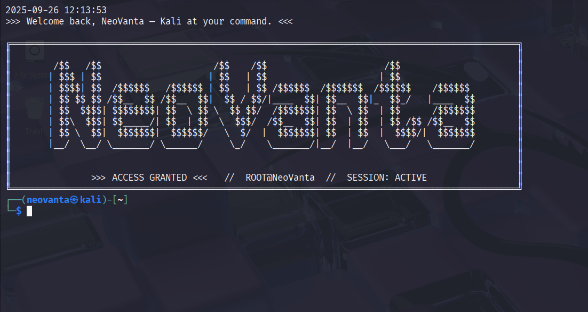

# neo-banner

A fun, interactive Bash banner for your terminal!  
It displays a NeoVanta-themed ASCII art box with a typewriter effect, showing the date/time and a personalized welcome message whenever you open your terminal.

---

## Features
- Typewriter effect for text display using `sleep` and `for` loop.
- ASCII art banner with root session style.
- Easy to integrate into your `.zshrc` or `.bashrc`.
- ASCII art generated using [patorjk.com](https://patorjk.com/software/taag/) with the font **Big Money -ne**.

---
## Preview

---

## How to Use

1. **Clone the repository**
```bash
git clone https://github.com/<your-username>/neo-banner.git
cd neo-banner
```
2.Add Banner to your .zshrc or .bashrc
```
nano ~/.zshrc
# Copy the contents of banner.sh (or your script) at the end of the file
# Save the file using Ctrl+X, then Y, then Enter
```
3. Open New terminal

Now, every time you open a terminal, the banner will appear!!

